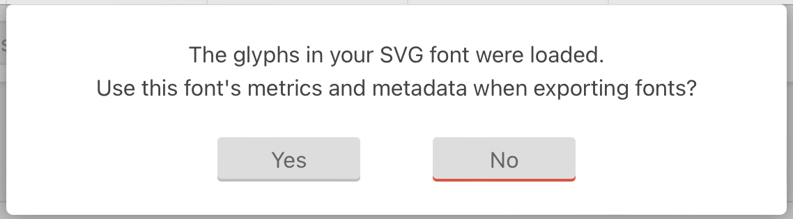

# How adding a new set icon

## Prerequisites

You need to have a icomoon account: https://icomoon.io/app/
For future steps, i recommande to import actual set of keyrune's icons in icomoon.

A model asking for "The glyphs in your SVG font were loaded.
Use this font's metrics and metadata when exporting fonts?" will appear, click on "Yes".

🎉 Success, you have now all the keyrune's icons in your icomoon project. That will be useful for the next steps when we need to generate the font.

## Summary

1. [Update fonts and svg with the new icon](./contributing/UpdateFonts.md)
2. [Update codebase to handle the new icon](./contributing/UpdateCodebase.md)
3. [Generate associated css](./contributing/GenerateCss.md)
4. [Update the documentation](./contributing/UpdateDocumentation.md)