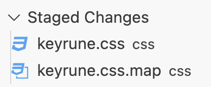

# Generate CSS

> Example with the set icon of the set "Foundation" (FDN)

## Steps

Generate the CSS files with the following commands:

```bash
npm run less && npm run lessmin
```
If you prefer to use the Sass source, run these instead:

```bash
npm run sass && npm run sassmin
```

2 files will be generated in the `css` folder: `keyrune.css` and `keyrune.min.css`.



Yaay 🎉 you have generated the CSS files! Now you can use the new icon(s) that were added, if any. Follow the [Usage inside README.md](../README.md#usage)

---
**Go to the next step: [Update the documentation](./UpdateDocumentation.md)**
---