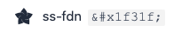
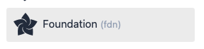

# Update existing documentation

After you have added a new set icon, update the codebase and generate the new `keyrune.css` file, you need to update the documentation to reflect the changes.

## Steps

1. Run this command
    ```bash
    npm run build
    ```
    This will compile LESS, minify CSS, and copy fonts and CSS files to the `docs` folder.
2. Add the new icon usage inside the `cheatsheet.html`.
    ```diff
    + <span class="utf"><i>&#xe9d8;</i> ss-fdn <code>&amp;#xe9d8;</code></span>
    ```
    Replace `fdn` with the short code of the new icon.
3. Add the new icon usage inside the `icons.html`.
    ```diff
    + <div class="icon" id="fdn" name="Foundation" data-name="Foundation" data-class="fdn" data-unicode="xe9d8" data-added="v3.14.0">
    +    <span class="name"><i class="ss ss-fdn"></i> Foundation <em>(fdn)</em></span>
    + </div>
    ```
    Replace `fdn` with the short code of the new icon.

    `data-added` records the Keyrune version that introduced this symbol and appears in the icon details modal.

Run `npm run dev` to preview the docs with automatic browser reload. Run `npm run check` to check codepoint mappings, versions, and generated assets.
Normally you can see the changes in the `./cheatsheet.html` and `./icons.html` .

 

Yaay! You have successfully updated the documentation. 🎉

You can now commit your changes and create a pull request.