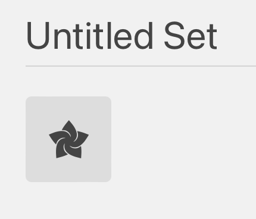
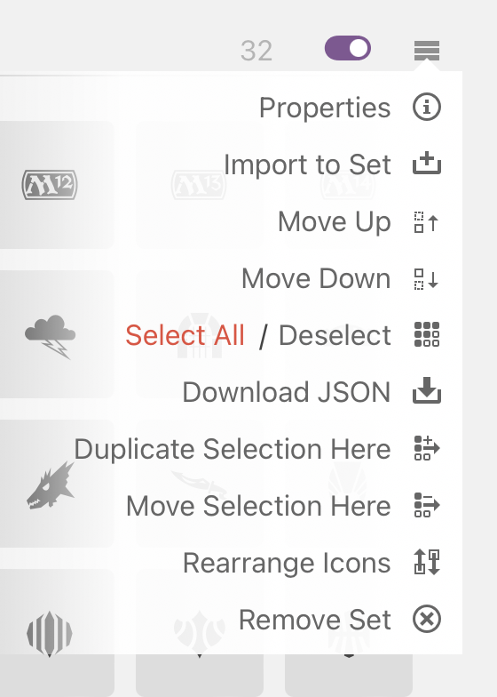
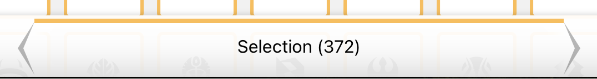
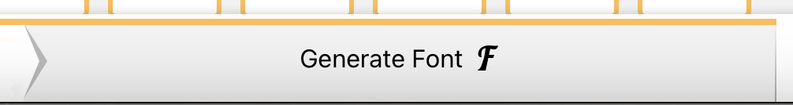
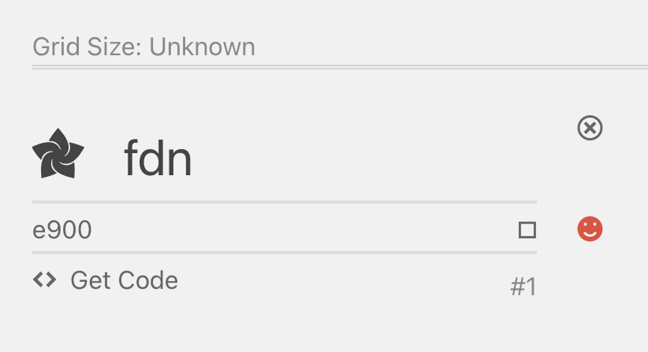
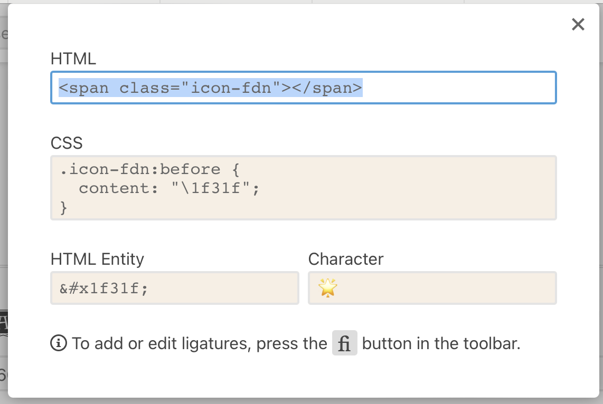
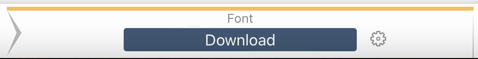
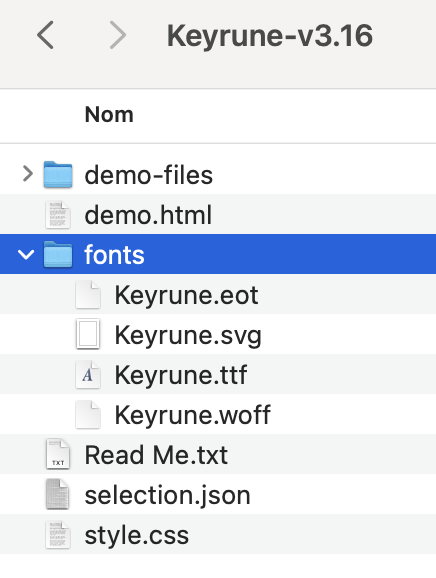

# Update Fonts

> Example with the set icon of the set "Foundation" (FDN)

## Steps

1. Search for the icon you want to add (from scryfall.com: https://svgs.scryfall.io/sets/fdn.svg) and download it (inspect DOM and copy/paste in a blank file). Save it in a temporary folder in your desktop.

2. In Icomoon, click on the "Import Icons" button. Select the previously downloaded icon. It will be added in a "Untilited Set".

    

3. Now you need to select all the icons you want to add in the font + the new one. On top right of each section you can find a menu with "Select all" and "Deselect all".

    

4. On the bottom of the page, you can check that you have the right number of icons selected. (Actual number + 1, the new one)

    

5. You can now click on the "Generate Font" button. You will be redirect to a page whith all setting for each icon.

    

6. Find your new icon and click on the "smiley" button to search for a unicode character and select it.

    

    🚧 Be sure to select a character that is not already used in the font.🚧

    You can check how your icon will be displayed in the font by clicking on the "Get code </>" button.

    

> If you have info about how to determine wich character is free, please add it in this doc here. 🙏
> What I do is when i have selected my unicode character, i search in all the codebase if it's already used. If not, i use it.

7. You can now donwload the font by clicking on the "Download" button. You get a zip file with all the files needed.

    

8. Unzip the file and copy the `fonts` folder in the keyrune `fonts` folder. Normally you will have the `keyrune.eot`, `keyrune.svg`, `keyrune.ttf`, `keyrune.woff` files.

    

Yaay 🎉 you have update the keyrune font! And have your new icon available.

---
**Go to the next step: [Update codebase to handle the new icon](./UpdateCodebase.md)**
---

## Extra steps

One files is missing inside the generated fonts, it's the `keyrune.woff2`. To get it you need to convert the `keyrune.woff` with online tools like [Cloudconvert](https://cloudconvert.com/)